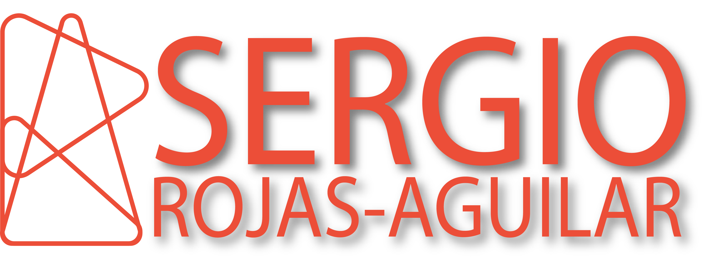

# Portfolio React Rev1

Welcome to my portfolio! This document serves as a guide to help you navigate through my work, skills, and experiences. Feel free to explore the various sections to gain insights into my professional journey and the projects I've undertaken.

## Table of Contents

1. [About Me](#about-me)
2. [Skills](#skills)
3. [Education](#education)
4. [Work Experience](#work-experience)
5. [Projects](#projects)
6. [Contact Information](#contact-information)

---

## About Me

I am a passionate and dedicated [Your Profession/Field] with a strong background in [Your Specializations]. Over the years, I have honed my skills in [Key Skills] and have a keen interest in [Your Interests]. I thrive on challenges and am constantly seeking opportunities to learn and grow in my field.

---

## Skills

### Technical Skills

- **Programming Languages:** [List of Programming Languages]
- **Web Development:** [Frontend and Backend Technologies]
- **Database:** [Database Management Systems]
- **Other Tools:** [Frameworks, Libraries, and Tools]

### Soft Skills

- **Communication:** Effective verbal and written communication.
- **Teamwork:** Collaborative and able to work well in a team.
- **Problem-Solving:** Analytical mindset and creative problem-solving skills.

---

## Education

- **Architectiure BS, New Jersey Institute of Technology, 2017**
    - School of Architecture and Design
    - 323 Martin Luther King Jr. Blvd,
    - Newark, NJ 07103

- **Absegami High School, [2012]**
    - 201 S. Wrangleboro Road
    - Galloway, NJ 08205
    - GPA- 93.486

---

## Work Experience

### [Current/Previous Job Title] - [Company Name] ([Date Started] to [Date Ended])

- [Brief description of your role and responsibilities]
- [Highlight any achievements or notable projects]

### [Previous Job Title] - [Company Name] ([Date Started] to [Date Ended])

- [Brief description of your role and responsibilities]
- [Highlight any achievements or notable projects]

---

## Projects

### Tech-Blog

- **Description:** Solo Project to create a social media page where you can log in securely using encryption. View other users’ posts, create your own or comment on existing posts. Using MySql to create a database that can be live throughout different devices. API for backend using Express and Sessions. And rendering the HTML dynamically using Handlebars to create each page.

- **Technologies Used:** NODES, MYSQL, EXPRESS, SESSIONS, BYCRPT, HANDLEBARS, SEQUILIZE, NODEMON, HEROKU, CSS, HTML, JAVASCRIPT, PREMIERE
- **Link:** https://the-technology-blog-1a45bd1d041b.herokuapp.com/

more prpject to come...

## Contact Information

Feel free to reach out to me if you have any questions, opportunities, or just want to connect. I can be reached via:

- **Email:** Sergrojas29@gmail.com
- **LinkedIn:** https://www.linkedin.com/in/sergio-rojas-aguilar-2a003a288/
- **GitHub:** https://github.com/Sergrojas29

I look forward to connecting with you!

---

Thank you for visiting my portfolio. I hope you find it informative and engaging. If you have any feedback or suggestions, please don't hesitate to let me know.